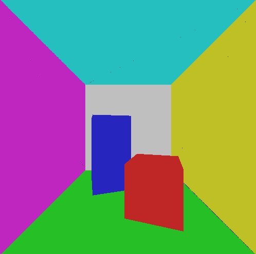
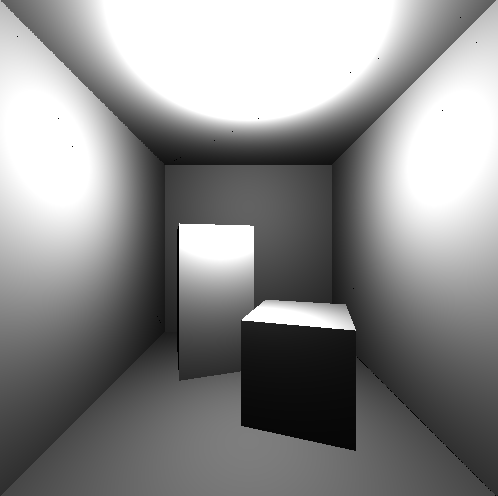
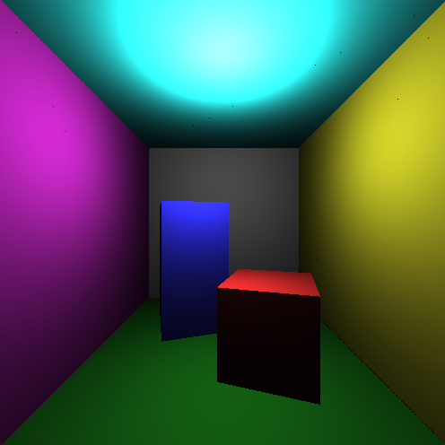
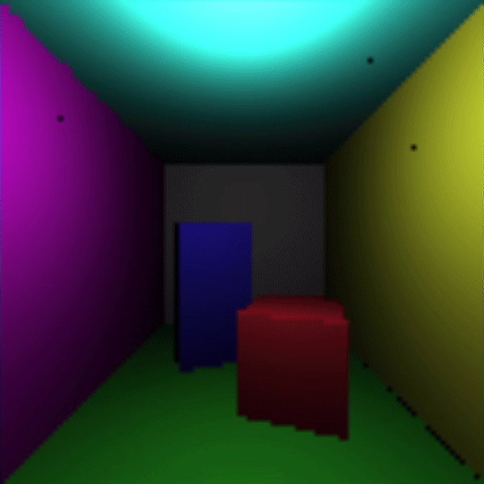
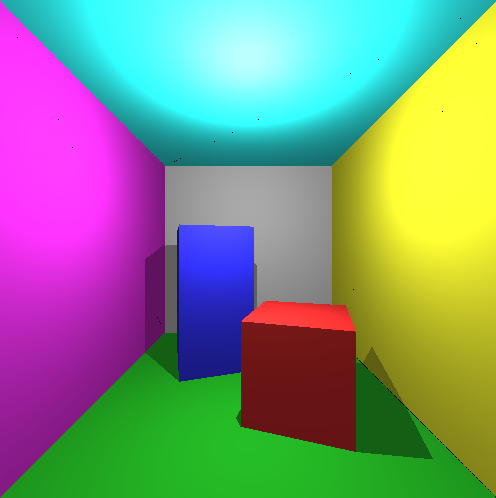
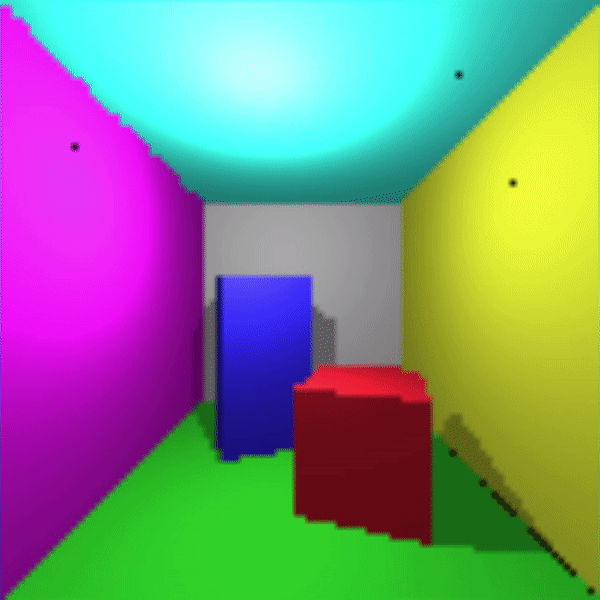

# Computer Graphics Labs
This repo serves me the sole purpose to track my work on the labs.

## LAB 1: SDL 
Getting to know SDL2.
  

  
## LAB 2: RAYTRACER
Time to build a Raytracer with SDL2.
  
<h3>Initial attempts</h3>

      
      
      

It took a while to understand it was not a mistake but simply the focal length was too small. Adjusting it made me realize what the problem was.
    
<h3>Added lighting</h3>

      
      

Lighting intensity with no colors nor shadows, resolution is 100x100 to make interactivity possible.
    

      
      

Colors added in together with lighting.
    

      
      

After adding in shadows + direct lighting + ambient lighting
## LAB 3: RASTERIZER

