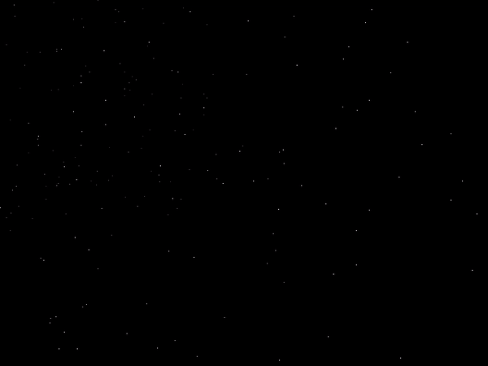
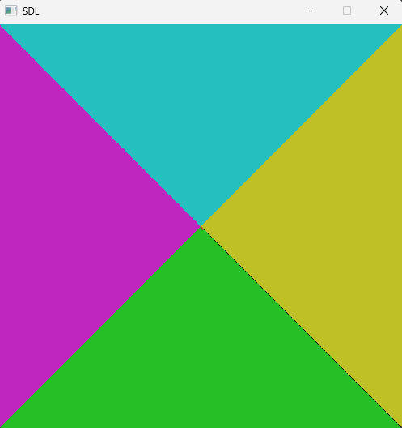
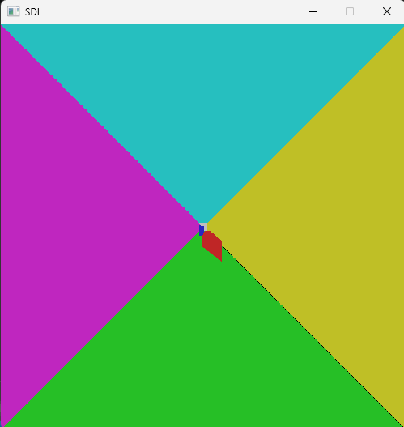

# Computer Graphics Labs
This repo serves me the sole purpose to track my work on the labs.

## LAB 1
Getting to know SDL2.
  

  
## LAB 2
Time to build a Raytracer with SDL2.
  

      
      

It took a while to understand it was not a mistake but simply the focal length was too small. Adjusting it made me realize what the problem was.

