# Computer Graphics Labs
This repo serves me the sole purpose to track my work on the labs.

## LAB 1: SDL 
Getting to know SDL2.
  
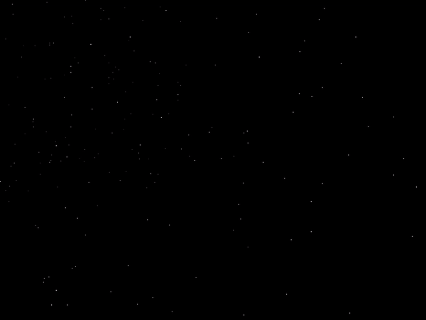
  
## LAB 2: RAYTRACER
Time to build a Raytracer with SDL2.
  
<h3>Initial attempts</h3>

      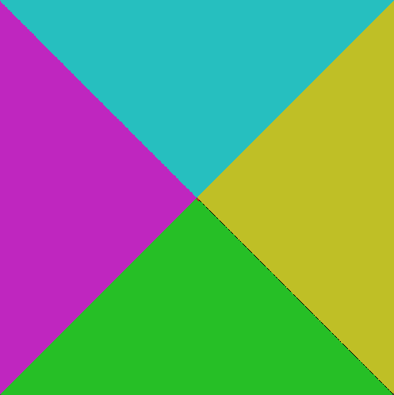
      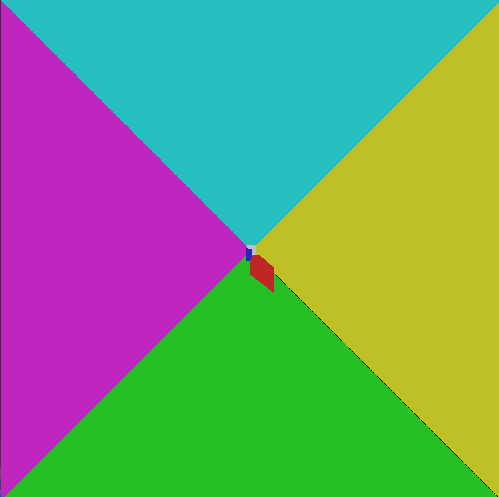
      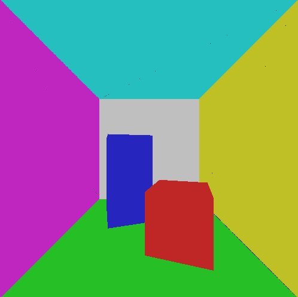

It took a while to understand it was not a mistake but simply the focal length was too small. Adjusting it made me realize what the problem was.
    
<h3>Added lighting</h3>

      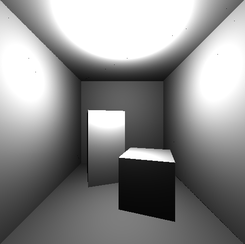
      

Lighting intensity with no colors nor shadows, resolution is 100x100 to make interactivity possible.
    

      
      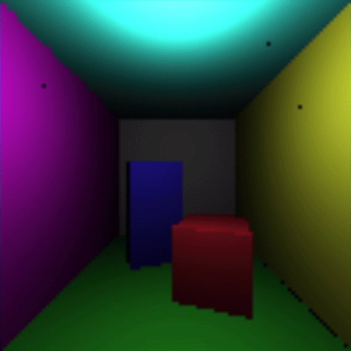

Colors added in together with lighting.
    

      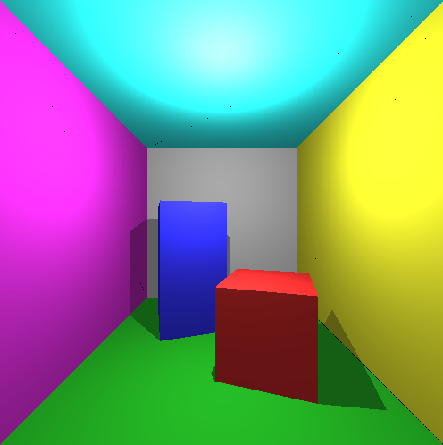
      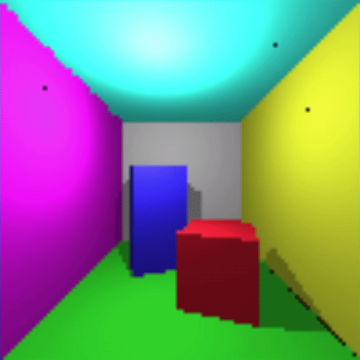

After adding in shadows + direct lighting + ambient lighting

## LAB 3: RASTERIZER
After building a simple raytracer, it's time to build a resterizer!
  

      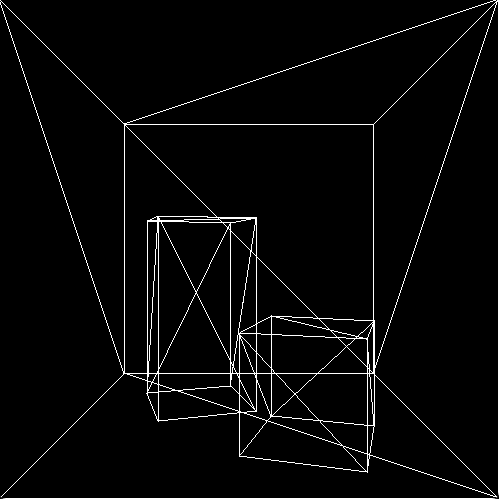
      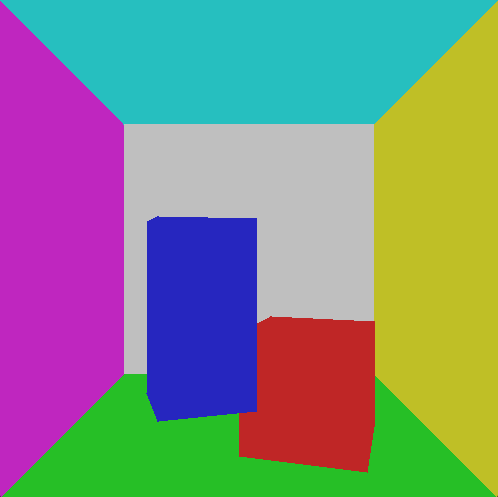

First, projection was implemented, while also drawing lines between these projected points. Then color is added by drawing lines from one side to the other of each triangle (polygon). Z-buffer not yet implemented.

### Per vertex illumination

      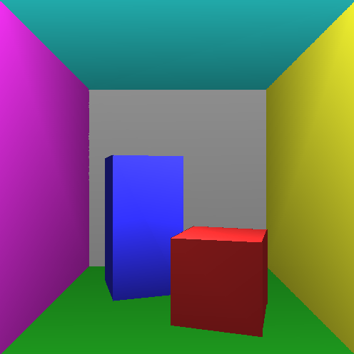

Lighting is calculated per vertex, and then values are interpolated along the polygon. Z-buffer was also implemented to account for depth.

### Per pixel illumination

       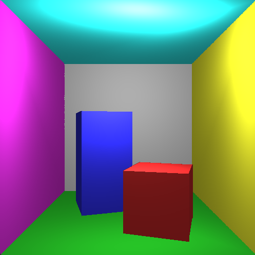
       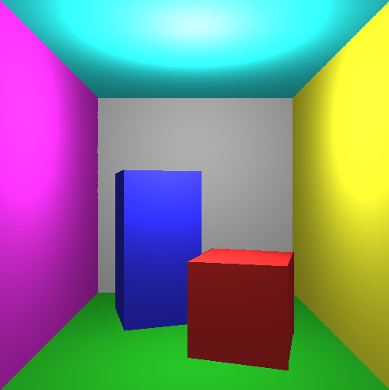

Maybe not immediately noticeable, but looking closely, lighting effect is a bit skewed.
 
The second image does not have the skew effect because perspective correct
interpolation was used for the 3D position of the pixels.
    

       

In this case, no interpolation is performed for the lighting, but pixel positions are interpolated. Lighting is then calculated for each pixel, making the final result more accurate.

## Camera Movement + Light Source Movement

      
       

